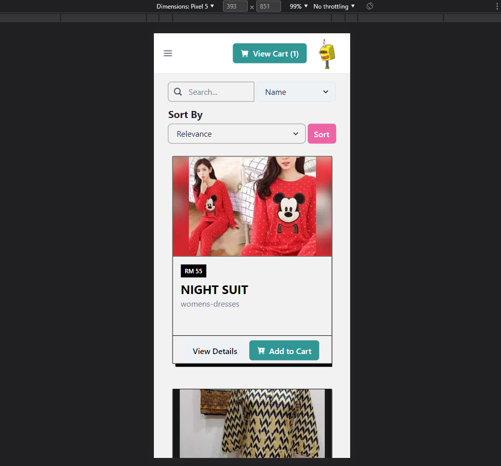

# RedSquare_frontend assessment -Royce
Front end application catered for mobile platforms.
Built using React, with component library ChakraUI.

## Start
cd to \redsquare_frontend\question2_folder\client
run "npm start"

Ported over some components from my previous project as a skeleton.
Referenced external sites in a component basis.
Referenced external UI for:
1. Navbar https://chakra-templates.dev/templates/navigation/navbar/withSubnavigation
2. Product Cards https://freefrontend.com/bootstrap-product-cards/

Code is modified based on own use case.

## Application
  